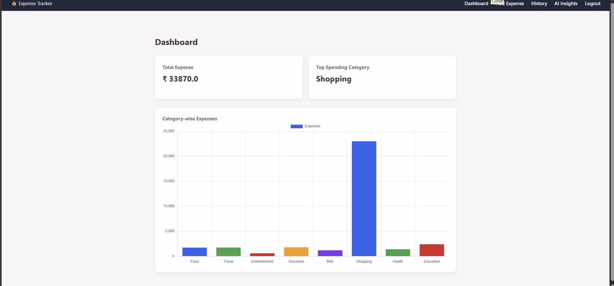
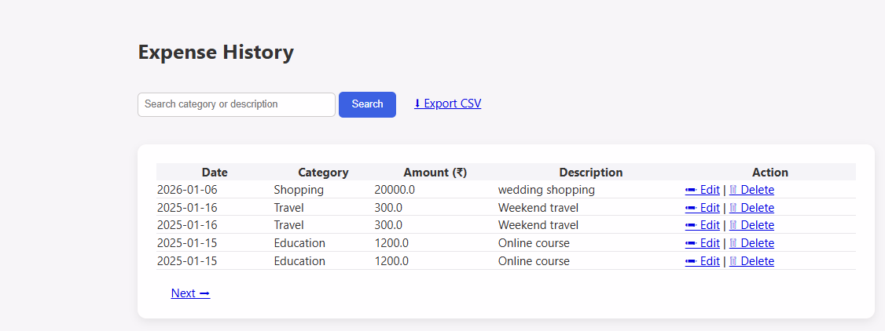
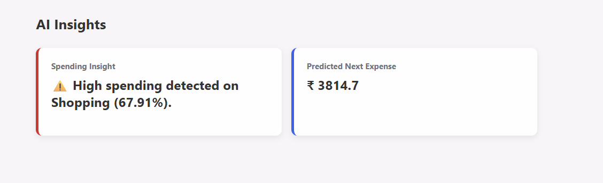

# AI Personal Expense Tracker 💸

A full-stack AI-based personal expense tracker built using **Flask**, **SQLite**, and **Machine Learning**.  
It helps users track expenses, analyze spending patterns, and get AI-powered insights.

---

## 🚀 Features

- 🔐 User Authentication (Login & Signup)
- ➕ Add, Edit & Delete Expenses
- 📊 Dashboard with Category-wise Charts
- 📈 Monthly Expense Trend Analysis
- 🤖 AI Insights using Machine Learning
- 🔍 Expense History with Search & Pagination
- 📁 Export Expenses to CSV
- 🎨 Clean UI with HTML & CSS

---

## 🛠️ Tech Stack

- **Backend:** Python, Flask
- **Database:** SQLite
- **Frontend:** HTML, CSS
- **Data Analysis:** Pandas, NumPy
- **Machine Learning:** Scikit-learn
- **Version Control:** Git & GitHub

---

## 📂 Project Structure

## 📸 Screenshots

### Dashboard

### Add Expense

### Expense History

### AI Insights

### Login

